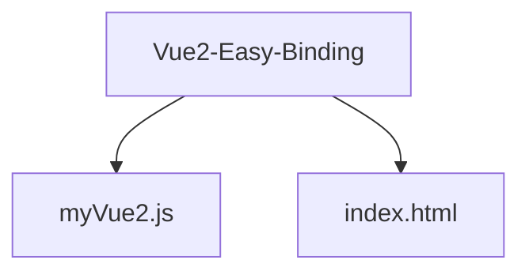
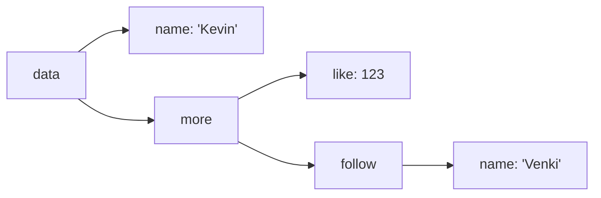

## Vue2双向绑定

### 参考视频

https://www.bilibili.com/video/BV1934y1a7MN/?spm_id_from=333.999.0.0

### 源码地址

[GitHub地址](https://github.com/Wadehl/Vue2-Eazy-Binding)

### 目录结构



### 基础结构 - index.html

```html
<!DOCTYPE html>
<html>
    <head>
   		<meta charset="UTF-8" />
        <meta name="viewport" content="width=content-width, initial-scale=1.0" />
        <title>Vue2 双向绑定Demo</title>
	</head>
    <body>
        <div id="app">
            <input v-model="name" type="text" />
      		姓名: {{name}}
      		<br />
            <input v-model="more.like" type="text" />
      		点赞：{{more.like}}
      		<br />
      		<input v-model="more.follow.name" type="text" />
      		Follow By: {{more.follow.name}}
        </div>
		<script src="./myVue2.js"></script>
    </body>
</html>
```


### 实现 - myVue2.js

#### 1. 创建Vue实例

```html
<!-- index.html -->

<script src="./myVue2.js"></script>
<script>
    // 创建Vue实例
    const vm = new Vue({
        el: "#app",
        data: {
            name: "Kevin",
            more: {
                like: 123,
                follow: {
                    name: "Venki",
                },
            },
        },
    });
</script>
```


#### 2. 创建Vue类

```js
// myVue2.js
class Vue{
    constructor(obj_instance) {
        this.$data = obj_instance.data;
    }
}
```


#### 3. 数据劫持

**示例data数据结构**:



```js
// myVue2.js
const Observer = (data_instance) => {
    // 获取data_instance的key
    Object.keys(data_instance).forEach((item) => {
        Object.defineProperty(data_instance, item, {
            enumerable: true, // 可枚举(for...in...)
            configurable: true, // 可改可删除
            get() {
                // 当属性被访问的时候调用
                
            },
            set(newValue) {
                // 当属性被修改的时候访问
            },
        })
    })
}
```


> 由于get的时候不应该访问数据return，因为这样会导致get的时候又触发get，因此需要提前取出当前item对应的值。

```diff
// myVue2.js
const Observer = (data_instance) => {
    // 获取data_instance的key
    Object.keys(data_instance).forEach((item) => {
+		let value = data_instance[item];
        Object.defineProperty(data_instance, item, {
            // ...
            get() {
                // 当属性被访问的时候调用
-				return data_instance[item]; // 错误示范
+				return value;
            },
            set(newValue) {
            	// 当属性被修改的时候访问
+				value = newValue;
            }
        })
    })
}
```

<div style="display: flex; justify-content: space-around;">
    
	
</div>


> 通过vm实例，发现只有第一层的`more`与`name`实现了监听，第二层的`follow`、`like`，第三层的`name`都没有，因此我们需要递归实现监听每一层的`item`

```diff
// myVue2.js
const Observer = (data_instance) => {
+   // 递归结束条件
+	if(!data_instance || typeof data_instance !== 'object') return;
    Object.keys(data_instance).forEach((item) => {
            let value = data_instance[item];
+			Observer(value);
            Object.defineProperty(data_instance, item, {

                // ...
            })
        })
}
```

<div style="display: flex; justify-content: space-around;">
    
	
</div>


> 此时已经实现深层的监听，但是当我们将原有的值变为Object的时候，新的类型的值不会自动被监听。因此，我们需要监听新的value。

```diff
// myVue2.js
const Observer = (data_instance) => {
	// ...
    Object.keys(data_instance).forEach((item) => {
			// ...
            Object.defineProperty(data_instance, item, {
                // ...
                set(newValue) {
                	value = newValue;
+					Observer(value);
                }
            })
        })
}
```


> 至此，完整的数据劫持方法已经实现，对`Vue`类进行数据劫持

```js
// myVue2.js
class Vue {
    constructor(obj_instance) {
        this.$data = obj_instance.data;
        Observer(this.$data);
    }
}

const Observer = (data_instance) => {
  // 递归结束条件结束
  if (!data_instance || typeof data_instance !== "object") return;
  Object.keys(data_instance).forEach((item) => {
    let value = data_instance[item];
    Observer(value);
    Object.defineProperty(data_instance, item, {
      enumerable: true,
      configurable: true,
      get() {
        return value;
      },
      set(newValue) {
        value = newValue;
        Observer(value);
      },
    });
  });
};
```


#### 4. 页面渲染 

使用`DocumentFragment`模拟虚拟DOM。

> 绑定Vue实例DOM与vm，并创建DocumentFragment存储所有DOM节点

```js
// myVue2.js
const Compiler = (element, vm) => {
    // 绑定DOM节点 - 即div#app
    vm.$el = document.querySelector(element);
    const fragment = new DocumentFragment();
}
```

> 对类似`{{ name }}`进行渲染:

```js
const Compiler = (element, vm) => {
    // ...
    // (1) 获取element DOM所有子节点，并且先用fragment存储
    let childNode;
	while((childNode = vm.$el.firstChild)) {
		fragment.append(childNode);
	}
    // (2) 实际上，我们在这步只需要对文本进行处理，即#text，他们的共同点在于node.nodeType === 3
    // 递归渲染fragment
    compileFragment(fragment);
	function compileFragment(node) {
    	if (node.nodeType === 3) {
        	// 处理#text节点
    	}
    	node.childNodes.forEach((child) => {
      		compileFragment(child);
    	});
    }
    // (3) 将处理好的fragment进行渲染
    vm.$el.append(fragment);
}
```

> 事实上，我们需要做的是将一段文本中的`{{ name }}` -> `data_instance[name]`对应的值，已知`name`即为`key`的值。
>
> 因此我们使用正则表达式获取`{{ xxx }}`包裹的数据`xxx`。
>
> 正则表达式`Pattern` = `/\{\{\s*(\S+)\s*\}\}/`，`exec`返回的数组结构 `[满足的字段, 括号内的值, 满足的下标, 完整的值]`

```diff
const Compiler = (element, vm) => {
	// ...
	function compileFragment(node) {
+		const pattern = /\{\{\s*(\S+)\s*\}\}/;
    	if (node.nodeType === 3) {
        	// 处理#text节点
+        	const result = pattern.exec(node.nodeValue);
+			if(result) {
+				node.nodeValue = node.nodeValue.replace(pattern, vm.$data[result[1]]);
+			}
    	}
	// ...
}
```

> 此时发现，貌似`name`成功了，但是有两个`undefined`，打印一下对应的`key`。

<div style="display: flex; justify-content: space-around;">
    
	
</div>

> 说明：由于`key`是由'.'一层层连接的，`JS`没有递归取值，所以进行修改，我们把`key`使用'.'分割成为数组，对每次一层进行深入遍历直到最深，此时拿到的值即为真正的`value`。

```diff
const Compiler = (element, vm) => {
	// ...
	function compileFragment(node) {
		const pattern = /\{\{\s*(\S+)\s*\}\}/;
    	if (node.nodeType === 3) {
        	// 处理#text节点
        	const result = pattern.exec(node.nodeValue);
			if(result) {
+				const value = result[1].split('.').reduce((total, current)=> total[current], vm.$data);
-				node.nodeValue = node.nodeValue.replace(pattern, vm.$data[result[1]]);
+				node.nodeValue = node.nodeValue.replace(pattern, value);
			}
    	}
	// ...
}
```

> 此时，模板渲染已经能够正常显示了


```js
// myVue2.js
// 页面渲染
const Compiler = (element, vm) => {
  // 绑定DOM节点 - 即div#app
  vm.$el = document.querySelector(element);
  const fragment = new DocumentFragment();
  // 获取$el的所有子节点
  let childNode;
  while ((childNode = vm.$el.firstChild)) {
    fragment.append(childNode);
  }
  compileFragment(fragment);
  function compileFragment(node) {
    const pattern = /\{\{\s*(\S+)\s*\}\}/;
    if (node.nodeType === 3) {
      const result = pattern.exec(node.nodeValue);
      if (result) {
        // console.log(result[1]);
        const value = result[1]
          .split(".")
          .reduce((total, current) => total[current], vm.$data);
        node.nodeValue = node.nodeValue.replace(pattern, value);
      }
    }
    node.childNodes.forEach((child) => {
      compileFragment(child);
    });
  }
  vm.$el.append(fragment);
};
```


#### 5. 发布订阅模式

> 当我们修改了`vm.$data`的内容的时候，此时，页面并不会重新渲染，因此我们需要实现一个更改值后实时==发布通知==的功能，那么需要新建接收通知的对象(订阅者)与发布通知的对象(发布者)。

```js
class Publisher {
  constructor() {
    this.subscribers = [];
  }
  addSub(subscriber) {
  	// 添加订阅者
    this.subscribers.push(subscriber);
  }
  notify() {
  	// 发布消息，通知所有订阅者更新数据
    this.subscribers.forEach((subscriber) => subscriber.update());
  }
}

class Subscriber {
  constructor(vm, key, callback) {
    this.vm = vm;
    this.key = key;
    this.callback = callback;
  }
  update() {
    this.callback();
  }
}
```


> 此时，考虑一下我们什么时候会添加订阅者，什么时候会发布通知。
> 	- 发布通知：一般当数据被修改的时候会通知订阅者，而数据修改的时候会触发`Set`方法，因此，在`Set()`的最后就可以通知更新数据。
> 	- 添加订阅者：一般遇到`{{}}`、 `v-model`、 `v-bind`的时候新建订阅者，并且将新建的订阅者，每次新建订阅者后，`callback`都会访问一次对象的值，即触发`Get`方法，因此在`Get()`的时候将==此次==的订阅者入订阅者队列。

```diff
const Observer = (data_instance) => {
+  	const publisher = new Publisher();
  	// ...
  	Object.keys(data_instance).forEach((item) => {
    	let value = data_instance[item];
    	Observer(value);
    	Object.defineProperty(data_instance, item, {
      		// ...
      		get() {
+				publisher.addSub({此次的subscriber}) // 怎么获取此次的subscriber呢？
        		return value;
      		},
      		set(newValue) {
        		value = newValue;
        		Observer(value);
+				publisher.notify();
      		},
   	 	});
  	});
};

const Compiler = (element, vm) => {
      // ...
      function compileFragment(node) {
        	const pattern = /\{\{\s*(\S+)\s*\}\}/;
        	if (node.nodeType === 3) {
          	const result = pattern.exec(node.nodeValue);
          	if (result) {
            	const value = result[1]
              	.split(".")
              	.reduce((total, current) => total[current], vm.$data);
            	node.nodeValue = node.nodeValue.replace(pattern, value);
+				new Watcher(vm, result[1], (newValue)=>{
+					node.nodeValue = node.nodeValue.replace(pattern, newValue); // 正确吗?
+				})
          	}
        }
        // ...
    }
};
```


>这里有两个问题:
>
>- 怎么获取此次的subscriber进行入队操作呢？
>
>- Watcher里面还是用node.nodeValue进行替换吗？ ❌
>
>
>
>针对第一个问题：
>
>​	我们可以在new `Subscriber`对象的时候，往`Publisher`里面添加一个临时变量`temp`存储当前的`new Subscriber`即`this`，入队的时候将`Publisher.temp`入队即可（有的话）。
>
>针对第二个问题：
>
>​	因为node.nodeValue实际上已经被处理(`replace`)过一次了，因此提前将`node.nodeValue`存储一次皆可。


```diff
const Observer = (data_instance) => {
+  	const publisher = new Publisher();
  	// ...
  	Object.keys(data_instance).forEach((item) => {
    	let value = data_instance[item];
    	Observer(value);
    	Object.defineProperty(data_instance, item, {
      		// ...
      		get() {
-				publisher.addSub({此次的subscriber}) // 怎么获取此次的subscriber呢？
+				Publisher.temp && publisher.addSub(Publisher.temp);
        		return value;
      		},
      		set(newValue) {
        		value = newValue;
        		Observer(value);
				publisher.notify();
      		},
   	 	});
  	});
};

const Compiler = (element, vm) => {
      // ...
      function compileFragment(node) {
        	const pattern = /\{\{\s*(\S+)\s*\}\}/;
        	if (node.nodeType === 3) {
          	const result = pattern.exec(node.nodeValue);
+			const initNodeValue = node.nodeValue;
          	if (result) {
            	const value = result[1]
              	.split(".")
              	.reduce((total, current) => total[current], vm.$data);
            	node.nodeValue = node.nodeValue.replace(pattern, value);
				new Watcher(vm, result[1], (newValue)=>{
-					node.nodeValue = node.nodeValue.replace(pattern, newValue); // 正确吗? ❌
+					node.nodeValue = initNodeValue.replace(pattern, newValue);
				})
          	}
        }
        // ...
    }
};

class Subscriber {
	constructor(vm, key, callback) {
		// ...
+		Publisher.temp = this;
+    	key.split(".").reduce((total, current) => total[current], vm.$data);
+    	Publisher.temp = null;
	}
	update() {
-		this.callback();
+		const value = this.key.split(".").reduce((total, current) => total[current], this.vm.$data);
+		this.callback(value);
	}
}
```


> 此时，当值被更改的时候，页面也会刷新。


#### 6. v-model 双向绑定

> 现在还有一个问题就是要`input`与`vm.$data`双向绑定。
>
> ​	其实，只需要在渲染的时候，与`#text`相同处理实现`input`展示`data`的值，并添加新的`Subscriber`;当`input`输入内容的时候，更新`data`，添加绑定事件(`addEventListener`)即可。

```diff
const Compiler = (element, vm) => {
      // ...
      function compileFragment(node) {
        	const pattern = /\{\{\s*(\S+)\s*\}\}/;
        	if (node.nodeType === 3) {...}
+			// data -> input.value 单向绑定
+			if (node.nodeType === 1 && node.nodeName === "INPUT") {
+           	const attributes = Array.from(node.attributes);
+           	attributes.forEach((attr) => {
+               	if (attr.nodeName === "v-model") {
+                 		const value = attr.nodeValue
+                   		.split(".")
+                   		.reduce((total, current) => total[current], vm.$data);
+                  	node.value = value;
+                   new Watcher(vm, attr.nodeValue, (newValue)=>{
+                       	node.value = newValue;
+                   	})
+                	}
+           	});
+				// input.value -> data 单向绑定
+				node.addEventListener('input', (e)=>{
+            		const arr = attr.nodeValue.split('.');	// 获取所有层的key
+            		const arr2 = arr.slice(0, arr.length-1);	// 排去最后一层的key
+            		const final = arr2.reduce((total, current)=> total[current], vm.$data);	// 一直递归到倒数第二层
+            		final[arr[arr.length-1]] = e.target.value;	// 倒数第二层[最后一个key] = 最底下的值
+          		});
+           }
        }
        // ...
    }
};
```


> 至此，一个基于`Object.defineProperty`的简易双向绑定实现了。


### 写在最后

>这里其实还有一个问题不是很清楚，那就是为什么`Subscriber`的构造函数里面需要对`key`进行一个递归呢？
